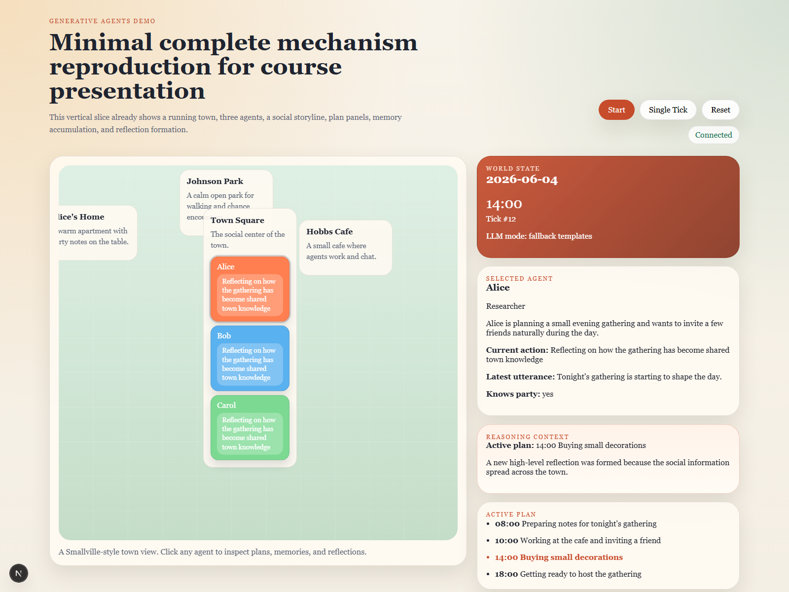
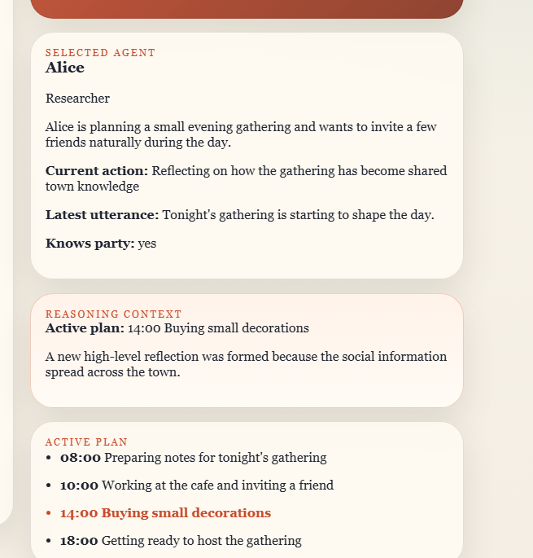

# Generative Agents Course Demo

This repository contains a course-demo-scale reproduction of *Generative Agents: Interactive Simulacra of Human Behavior*.

## For Reviewers

If you only want to pull the code and run the demo locally:

```bash
git clone https://github.com/guojiageng99/three.git
cd three
```

Then:

1. Start the backend on `127.0.0.1:8000`
2. Start the frontend on `localhost:3000`
3. Open `http://localhost:3000`
4. Advance the simulation from the UI and observe movement, memory, dialogue, and reflection

## Project Scope

The system focuses on a minimum complete cognitive loop for classroom demonstration:

- a small town map with 4 locations
- 3 NPCs: Alice, Bob, and Carol
- time progression and schedule-driven movement
- memory recording and lightweight retrieval
- action and dialogue generation
- reflection generation after social information spreads
- a frontend panel that explains plans, retrieved memories, and reasoning

## Demo Storyline

The built-in storyline is stable for recording and presentation:

- `10:00` Alice shares the evening gathering with Bob
- `14:00` Bob passes the information to Carol
- after 3 agents know the event, the system produces shared reflection

This makes the demo easy to explain and repeat during a 10-minute course presentation.

## What To Look At In The Demo

When reviewing the project, focus on these behaviors:

- agents move between locations according to schedule
- each agent keeps its own memory stream
- later actions and dialogue depend on recalled memories
- information spreads from one agent to another over time
- once enough social information accumulates, the system generates reflection

This is a teaching demo, so the goal is not a giant open-world simulation. The goal is to show the core cognitive loop of generative agents in a small, repeatable scenario.

## Screenshots

Overview:



Reasoning panel:


Reasoning detail crop:



## Tech Stack

- Frontend: Next.js + React
- Backend: FastAPI + Python
- Model mode: OpenAI-compatible API or deterministic fallback

## Run

Python `3.10+` is required. The current local setup was verified with Python `3.12.4`.
If you previously created `backend/.venv` with Python `3.9`, delete that virtual environment and recreate it before installing dependencies.

## Quick Start

If you want the shortest path:

1. Prepare Python `3.10+` and Node.js
2. Install backend dependencies from `backend/requirements.txt`
3. Install frontend dependencies from `frontend/package.json`
4. Start backend on port `8000`
5. Set `NEXT_PUBLIC_API_BASE=http://127.0.0.1:8000`
6. Start frontend and open `http://localhost:3000`

## Environment Requirements

- Python `3.10+`
- Node.js with `npm`
- Windows PowerShell or `cmd` is assumed in the command examples
- Optional: Conda, if you want to match the local development setup exactly

### Recommended Conda Setup

The local machine has already been prepared with a dedicated conda environment:

```bash
conda activate ga-demo
```

If you ever need to recreate it:

```bash
conda create -n ga-demo python=3.12 -y
conda run -n ga-demo python -m pip install -r backend/requirements.txt
```

### Backend

Recommended on Windows `cmd`:

```bat
conda activate ga-demo
cd /d E:\demo\buaa\suanfa\three\backend
python -m uvicorn app.main:app --reload --host 127.0.0.1 --port 8000
```

Recommended on Windows PowerShell:

```powershell
conda activate ga-demo
cd E:\demo\buaa\suanfa\three\backend
python -m uvicorn app.main:app --reload --host 127.0.0.1 --port 8000
```

If you prefer a local virtual environment instead of conda:

```bash
cd backend
python -m venv .venv
.venv\Scripts\activate
pip install -r requirements.txt
uvicorn app.main:app --reload --host 127.0.0.1 --port 8000
```

### Frontend

Windows `cmd`:

```bat
cd /d E:\demo\buaa\suanfa\three\frontend
set NEXT_PUBLIC_API_BASE=http://127.0.0.1:8000
npm install
npm run dev
```

Windows PowerShell:

```powershell
cd E:\demo\buaa\suanfa\three\frontend
$env:NEXT_PUBLIC_API_BASE="http://127.0.0.1:8000"
npm install
npm run dev
```

Open `http://localhost:3000` after both services start.

## Demo Operation Guide

After the page loads, use this sequence:

1. Click `Reset` to return to the initial state
2. Click `Single Tick` to advance the simulation step by step
3. Or click `Start` to let the world run continuously
4. Click an agent on the map to inspect plan, memory, dialogue, and reflection
5. Watch how the social event spreads from Alice to Bob and then to Carol

For explanation during review or presentation:

1. Start from the map and current simulation clock
2. Show the selected agent's current location and active plan
3. Explain how retrieved memories affect the next action or dialogue
4. Highlight when all three agents become aware of the gathering
5. Show the reflection output once enough social context has accumulated

## Detailed Demo Walkthrough

This section is the recommended classroom-demo script.  
It answers three questions for each step:

1. what to click
2. what you should see
3. which paper mechanism that behavior demonstrates

### Key Terms First

- `gathering`: Alice's evening social gathering
- `reflection`: a higher-level conclusion formed from several lower-level events or memories

Example:

- low-level memory: `Alice told Bob about the gathering`
- low-level memory: `Bob told Carol about the gathering`
- reflection: `The gathering is no longer private information. It has become shared town knowledge.`

### Before You Start

The best way to understand the demo is **not** to begin from a late state such as `20:00`.
Always begin from the initial state or from the prepared bookmarks.

Recommended options:

- click `08:00 初始态`
- or click `Reset`

### Step 1: Show the initial state at 08:00

**Click**

- `08:00 初始态`
- or `Reset`

**What you should see**

- time becomes `08:00`
- Alice is at `Alice's Home`
- Bob is at `Johnson Park`
- Carol is at `Town Square`
- only Alice knows about the gathering

**What to point at**

- click `Alice`
- show `Current Plan`
- click `Bob`
- show `Current Plan`
- click `Carol`
- show `Current Plan`

**What this demonstrates from the paper**

- each agent has its own plan
- agents do not move randomly
- the world starts with asymmetric knowledge: only one agent knows the event

This corresponds to the paper's mechanisms of:

- planning
- persistent internal state
- initial memory difference between agents

### Step 2: Advance to 10:00 and show the first information spread

**Click**

- `10:00 第一次传播`

If you want to demonstrate it manually instead:

- click `Single Tick` 4 times from `08:00`

**What you should see**

- time becomes `10:00`
- Alice and Bob are both at `Hobbs Cafe`
- event timeline shows a `share` event around `10:00`
- Bob now knows the gathering
- propagation chain shows `alice -> bob`

**What to point at**

1. on the map, show that Alice and Bob meet at the same location
2. in the event timeline, show the invitation-sharing event
3. click `Bob`
4. in the right panel, show:
   - `Knows gathering`
   - `Latest utterance`
   - `Retrieved memories`
   - `Recent memories`

**What this demonstrates from the paper**

- agents move according to plan and therefore meet naturally in the environment
- social interaction changes another agent's internal state
- a dialogue is not just text output; it creates new memory and new knowledge

This corresponds to the paper's mechanisms of:

- plan-driven movement
- social interaction
- memory update
- information propagation

### Step 3: Explain memory retrieval at the first spread state

**Click**

- stay at `10:00`
- click `Bob`

**What you should see**

- `Retrieved memories` contains items related to the gathering or the recent conversation
- the score explanation tags show why these memories were selected

**What to point at**

- show that the retrieved memories are not random
- show the score tags or retrieval explanation row
- then show `Reasoning Context`

**What this demonstrates from the paper**

- the agent does not use its entire memory bank at once
- it retrieves the most relevant memories for the current context
- current action depends on recalled memory, not only on the schedule

This corresponds to the paper's mechanisms of:

- memory stream
- retrieval
- context-conditioned action generation

### Step 4: Advance to 14:00 and show the second information spread

**Click**

- `14:00 第二次传播`

If you want to demonstrate it manually instead:

- continue ticking from `10:00` until `14:00`

**What you should see**

- time becomes `14:00`
- Alice, Bob, and Carol gather in `Town Square`
- the event timeline shows that Bob tells Carol about the gathering
- propagation chain becomes:
  - `alice -> bob`
  - `bob -> carol`
- Carol now knows the gathering

**What to point at**

1. on the map, show the three agents meeting in the square
2. in the propagation panel, show that Bob is now a secondary source of information
3. click `Carol`
4. show that Carol's memories and current reasoning have changed

**What this demonstrates from the paper**

- information spreads across multiple agents, not just from one source
- the system is simulating a social process rather than a single scripted answer
- local interactions accumulate into a larger world state change

This corresponds to the paper's mechanisms of:

- multi-agent social behavior
- chained propagation
- environment-mediated encounters

### Step 5: Advance to the reflection state and show high-level cognition

**Click**

- `14:30 反思形成态`

**What you should see**

- the phase becomes `反思形成`
- the event timeline contains `Reflection formed`
- each informed agent has a reflection entry
- current actions mention shared town knowledge or reflection

**What to point at**

1. in the timeline, show the reflection event
2. click Alice, Bob, or Carol
3. open the `Reflections` panel
4. read one reflection aloud

**What this demonstrates from the paper**

- the system does not stop at individual memories
- it summarizes multiple lower-level events into a higher-level conclusion
- that higher-level conclusion can influence later behavior

This corresponds to the paper's mechanisms of:

- reflection
- higher-level memory abstraction
- long-range behavioral coherence

### Step 6: Explain why this is a paper reproduction rather than only a UI demo

Use this sentence during presentation:

> This demo reproduces the paper's minimum complete mechanism: agents follow plans, meet in the environment, retrieve relevant memories, exchange information through dialogue, update internal state, and finally form higher-level reflection.

### Shortest Possible Presentation Flow

If time is very limited, use this exact sequence:

1. `08:00 初始态`
2. explain that only Alice knows the gathering
3. `10:00 第一次传播`
4. show `alice -> bob`
5. show Bob's retrieved memories and reasoning
6. `14:00 第二次传播`
7. show `bob -> carol`
8. `14:30 反思形成态`
9. show the reflection panel

This is the shortest reliable path for a 10-minute course video.

## API Reference

Backend base URL:

- `http://127.0.0.1:8000`

HTTP endpoints:

- `GET /api/state`: return the current world snapshot
- `POST /api/sim/start`: start continuous simulation
- `POST /api/sim/pause`: pause continuous simulation
- `POST /api/sim/tick`: advance by one tick
- `POST /api/sim/reset`: reset to the initial state

WebSocket endpoint:

- `WS /ws/state`: stream the latest world state to the frontend every second

Frontend connection rule:

- `NEXT_PUBLIC_API_BASE` defaults to `http://127.0.0.1:8000`
- the frontend derives the WebSocket URL automatically from that base URL

## Repository Structure

- `backend/app/`: FastAPI server, simulation engine, cognition, prompt templates, and world models
- `backend/requirements.txt`: backend Python dependencies
- `frontend/app/`: Next.js app entry and global styles
- `frontend/components/`: map view, controls, and sidebar panels
- `frontend/lib/`: API helpers and shared frontend types
- `submission_docs/`: PPT, report drafts, scripts, and screenshots
- `docs/`: design and planning notes
- `scripts/`: helper scripts for building submission materials
- `timeline_frames/`: extracted timeline images used in the project materials
- `frame_1.jpg` to `frame_5.jpg`: standalone image assets in the repository root

## Suggested Review Flow

For a teammate or reviewer, this order is the easiest:

1. Read this `README.md`
2. Run backend and frontend locally
3. Open the page and step through the built-in story
4. Check `submission_docs/` for PPT, scripts, and report materials
5. If needed, inspect `backend/app/` and `frontend/` for implementation details

## FAQ

### The frontend page opens, but no simulation state appears

Check whether the backend is running on `127.0.0.1:8000`. The frontend expects `NEXT_PUBLIC_API_BASE` to point there unless you override it.

### I changed the backend host or port

Update `NEXT_PUBLIC_API_BASE` before running the frontend. The WebSocket URL is derived from the same base address.

### No LLM API key is configured

That is fine. The project still runs with deterministic fallback logic, which is the easiest mode for classroom demo and teammate review.

### A previous virtual environment does not work

If `backend/.venv` was created with an older Python version, delete it and recreate it with Python `3.10+`.

### Port 3000 or 8000 is already occupied

Stop the conflicting process or change the port manually, then make sure the frontend base URL matches the backend port.

## Project Limitations

- this is a compact teaching demo, not a full-scale reproduction of the original paper
- the map contains 4 locations and 3 agents only
- the main story progression is intentionally fixed to make review, presentation, and recording repeatable
- the fallback mode prioritizes stability and explainability over open-ended generation

## Optional LLM Mode

The backend supports an OpenAI-compatible chat API.

```bash
set LLM_API_KEY=your_key
set LLM_BASE_URL=https://api.openai.com/v1
set LLM_MODEL=gpt-4o-mini
```

If `LLM_API_KEY` is not set, the simulation still runs with deterministic fallback behavior for plans, actions, dialogue, and reflections.

## Submission Materials

Prepared course materials are under `submission_docs/`:

- PPT deck
- report drafts and final markdown versions
- per-slide script
- 10-minute video script
- screenshots for the reports and slides

## Demo Operations

The frontend now supports presentation-oriented controls:

- `Single Tick`: advance the simulation by 30 minutes for step-by-step explanation
- `Save Snapshot` / `Load Snapshot`: save and restore a known demo state
- speed chips: switch between `0.5x`, `1x`, and `2x`
- scenario bookmarks:
  - `08:00 初始态`
  - `10:00 第一次传播`
  - `14:00 第二次传播`
  - `14:30 反思形成态`

These bookmarks are recommended for recording because they jump directly to the main proof points of the demo.

## Evidence Export

To generate structured report material from the current deterministic demo state:

```bash
python scripts/export_demo_evidence.py
```

This writes:

- `submission_docs/evidence/demo_evidence.json`
- `submission_docs/evidence/demo_evidence.md`

The Markdown file is intended to be reused directly in reports, PPT notes, or appendix material.

## Short Explanation For Teammates

You can forward this summary directly:

> This project is a small classroom demo of Generative Agents. The frontend visualizes a town map and each agent's plan, memory, reasoning, and dialogue. The backend simulates schedule, memory retrieval, dialogue generation, and reflection. By default it can run without an API key using deterministic fallback logic, so it is easy to reproduce locally.
