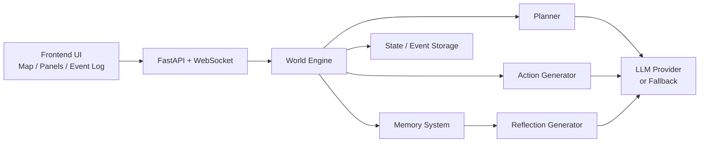
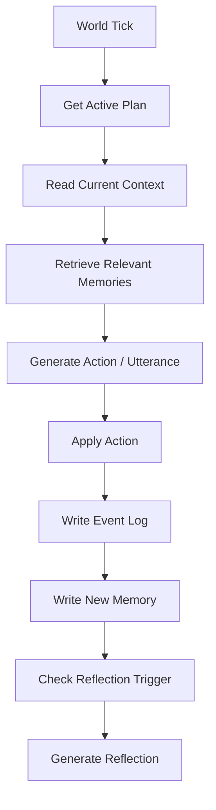
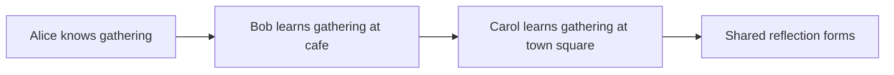

# 答辩素材与 PPT 提纲

## 一、建议的 25 页 PPT 结构

1. 标题页
2. 论文背景与研究问题
3. 为什么选择 Generative Agents
4. 论文核心思想总览
5. 论文中的关键机制
6. 本项目的复刻目标与范围
7. 为什么不做完整论文级复现
8. 系统总体架构图
9. 前端展示层设计
10. 后端仿真编排层设计
11. 认知层设计
12. 数据结构设计
13. 计划生成流程
14. 记忆检索流程
15. 行动与对话生成流程
16. 反思生成流程
17. LLM 模式与 fallback 模式
18. 界面展示：地图与状态面板
19. 界面展示：Agent 解释面板
20. 演示剧情链：Alice -> Bob -> Carol
21. 当前实现结果
22. 技术取舍与工程难点
23. 创新点总结
24. 局限性与后续工作
25. 总结与答辩

## 二、可直接放入 PPT 的架构图

### 2.1 总体架构图

### 2.2 行为数据流图

### 2.3 信息传播链图

## 三、演示视频建议脚本

### 3.1 视频结构

1. 项目背景与论文介绍
2. 复刻目标和范围说明
3. 系统架构讲解
4. 代码结构讲解
5. demo 运行展示
6. 单个 NPC 的 plan / memory / reasoning 解释
7. 社交传播链展示
8. reflection 展示
9. 技术难点与取舍总结

### 3.2 实操展示顺序

建议录屏顺序：

1. 启动后端
2. 启动前端
3. 展示地图与初始状态
4. 选中 Alice，解释她为什么一开始知道 gathering
5. tick 到 `10:00`，展示 Alice 和 Bob 在 cafe 相遇
6. 展示 Bob 新增的 memory
7. tick 到 `14:00`，展示 Bob 和 Carol 在 square 相遇
8. 展示 Carol 获得新信息
9. 展示 reflection 形成
10. 展示 reasoning context 面板

## 四、答辩时可直接说的关键句

### 4.1 项目定位

“我们没有追求论文级全量复现，而是围绕课程作业的时间约束，做了一个最小完整机制复刻。”

### 4.2 核心价值

“这个系统的重点不是地图，而是每个 NPC 的当前行为都由计划、记忆和当前环境共同决定。”

### 4.3 工程取舍

“为了兼顾稳定演示和大模型特色，我们采用了 LLM 优先、规则模板兜底的双模式方案。”

### 4.4 可解释性

“我们专门增加了 reasoning note 面板，用来解释某个 NPC 当前为什么采取这个动作，这一点对课堂答辩非常重要。”

### 4.5 结果亮点

“系统已经能稳定展示一条完整的信息传播链：Alice 把 gathering 告诉 Bob，Bob 再告诉 Carol，最后形成更高层的 shared reflection。”

## 五、当前代码与素材对应关系

### 5.1 代码核心文件

- [backend/app/simulation.py](E:\demo\buaa\suanfa\three\backend\app\simulation.py)
- [backend/app/cognition.py](E:\demo\buaa\suanfa\three\backend\app\cognition.py)
- [backend/app/prompt_templates.py](E:\demo\buaa\suanfa\three\backend\app\prompt_templates.py)
- [frontend/app/page.tsx](E:\demo\buaa\suanfa\three\frontend\app\page.tsx)
- [frontend/components/Sidebar.tsx](E:\demo\buaa\suanfa\three\frontend\components\Sidebar.tsx)
- [frontend/components/TownMap.tsx](E:\demo\buaa\suanfa\three\frontend\components\TownMap.tsx)

### 5.2 可截图的重点内容

- 地图主界面
- 世界时间与 LLM 模式显示
- Active plan 面板
- Retrieved memories 面板
- Reasoning context 面板
- Event log 中的传播链
- Reflection 面板

## 六、建议下一步

1. 在本地真实跑一次前后端，截取 5 到 8 张关键截图
2. 将本文件中的图直接放进 PPT
3. 用两份报告初稿补充截图与实现说明
4. 如果时间允许，接入一次真实 API key 录制 LLM 模式视频
