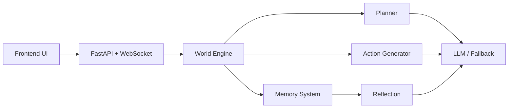

# 解题技术思路和最优方案报告

## 题目信息

**项目名称：** Generative Agents 论文复刻  
**论文名称：** *Generative Agents: Interactive Simulacra of Human Behavior*  
**系统类型：** 演示型多智能体社会仿真系统  
**技术栈：** Next.js、React、FastAPI、Python、OpenAI 兼容接口

## 摘要

本文给出课程作业项目“Generative Agents 论文复刻”的技术方案与最优实现路径。针对论文原始系统规模大、机制复杂、复现成本高的问题，本项目围绕“课程展示优先、机制闭环完整、工程复杂度受控”的原则，将原始论文压缩为一个 Smallville 风格的最小完整机制系统。系统采用前端展示层、后端仿真编排层、认知层和 LLM/fallback 配置层四层架构，实现了 3 个 NPC 在小镇环境中的计划驱动移动、记忆检索、行动生成、对话传播与高层反思生成。为兼顾生成式特征与演示稳定性，系统同时支持 LLM 模式与规则兜底模式。本文将从技术路线、系统架构、模块设计、关键创新点、工程取舍和实现现状等方面系统阐述本项目的最优方案。

## 关键词

Generative Agents；智能体系统；记忆检索；反思机制；多智能体传播；工程复刻

## 一、项目总体思路

本项目的总体思路不是“复刻论文中所有细节”，而是先识别论文中真正关键的机制，再选择一条适合课程作业交付的最优工程路径。

经过分析，我们认为论文中的核心机制可压缩为以下闭环：

`当前环境 -> 检索相关记忆 -> 结合计划生成动作 -> 发生互动 -> 更新记忆 -> 形成反思`

围绕这条闭环，项目总体方案被定义为：

1. 用小镇地图承载环境状态。
2. 用少量 NPC 承载角色差异。
3. 用计划系统保证行为目标性。
4. 用记忆系统保证行为连续性。
5. 用对话传播体现社会性。
6. 用反思机制体现高层总结能力。

这种方案相较于全量复现更加适合当前场景，因为它兼顾了：

- 可运行
- 可解释
- 可演示
- 可写报告
- 可录视频

## 二、技术路线设计

### 2.1 路线选择原则

系统设计遵循以下原则：

1. 先保证垂直打通，再做局部增强。
2. 先保证演示稳定，再增强生成能力。
3. 先保证可解释，再考虑规模扩展。
4. 优先使用轻量工程方案，避免过早引入高复杂基础设施。

### 2.2 技术栈选择

前端选择：

- Next.js
- React

原因：

- 易于快速构建可视化界面
- 便于实时状态展示
- 适合浏览器录屏

后端选择：

- Python
- FastAPI

原因：

- 适合构建仿真逻辑
- 适合与 LLM API 对接
- 数据结构表达清晰

模型接口选择：

- OpenAI 兼容接口

原因：

- 开发成本低
- 可替换性强
- 支持 fallback 双模式切换

## 三、系统总体架构

### 3.1 四层架构

本系统采用四层架构。

#### 第一层：前端展示层

负责：

- 地图展示
- NPC 状态展示
- 事件日志展示
- 解释面板展示

对应文件：

- [page.tsx](E:\demo\buaa\suanfa\three\frontend\app\page.tsx)
- [Sidebar.tsx](E:\demo\buaa\suanfa\three\frontend\components\Sidebar.tsx)
- [TownMap.tsx](E:\demo\buaa\suanfa\three\frontend\components\TownMap.tsx)

#### 第二层：仿真编排层

负责：

- 推进时间
- 更新位置
- 管理角色状态
- 触发事件传播
- 生成 world state

对应文件：

- [simulation.py](E:\demo\buaa\suanfa\three\backend\app\simulation.py)

#### 第三层：认知层

负责：

- daily plan 生成
- memory retrieval
- action generation
- dialogue generation
- reflection generation

对应文件：

- [cognition.py](E:\demo\buaa\suanfa\three\backend\app\cognition.py)

#### 第四层：配置与 prompt 层

负责：

- LLM 参数配置
- prompt 模板定义
- fallback 逻辑切换

对应文件：

- [prompt_templates.py](E:\demo\buaa\suanfa\three\backend\app\prompt_templates.py)
- [backend/.env.example](E:\demo\buaa\suanfa\three\backend\.env.example)

### 3.2 架构图

建议在最终版中插入架构图，或直接引用 PPT 中同款图示。

## 四、关键模块设计

### 4.1 世界引擎设计

世界引擎负责系统主循环。每一个 tick 中，系统会完成以下任务：

1. 推进世界时间
2. 为每个角色确定当前 active plan
3. 更新角色所在地点
4. 检索当前情境下的相关记忆
5. 生成当前动作和 utterance
6. 检查地点相遇情况
7. 触发对话传播
8. 在必要时生成 reflection

这个设计的价值在于：所有最终可见行为都统一从一个 world loop 中推进，逻辑集中，便于调试和答辩解释。

### 4.2 记忆系统设计

每个 Agent 拥有自己的 memory bank。  
当前记忆条目包含：

- 文本内容
- 时间戳
- 地点
- 重要性
- 相关角色
- 记忆类型

记忆类型分为：

- observation
- conversation
- reflection

设计意义：

- observation 保留环境行为
- conversation 记录社交传播
- reflection 提供高层语义总结

### 4.3 检索机制设计

在每次动作生成之前，系统会对 memory bank 中的内容进行打分，返回 Top-K 结果。  
打分主要考虑：

- 重要性
- 记忆新鲜度
- 当前地点一致性
- 当前附近角色相关性
- 文本关键词匹配

之所以采用这种轻量方案，而不是直接上向量数据库，原因有三点：

1. 课程作业时间有限
2. 目标是可解释而不是追求复杂基础设施
3. 当前演示规模较小，规则打分已经足够

### 4.4 计划生成设计

系统中的计划模块采用双模式：

- `LLM 生成`
- `静态计划兜底`

生成输入包括：

- agent profile
- 已有 reflection
- 可用地点列表

输出为粗粒度时间计划，例如：

- 08:00 在家准备
- 10:00 去咖啡馆工作并邀请朋友
- 14:00 去广场处理事务
- 18:00 回家准备 gathering

这一设计使得角色行为具备目标导向，而不是纯随机游走。

### 4.5 动作与对话生成设计

动作生成输入包括：

- 当前时间
- 当前地点
- active plan
- nearby agents
- retrieved memories

输出包括：

- summary
- utterance
- reasoning note

其中 reasoning note 是答辩友好增强字段，它会直接告诉用户：

`当前计划是什么、当前地点是什么、附近有哪些人、最重要的记忆线索是什么`

这大幅增强了系统的可解释性。

### 4.6 Reflection 机制设计

reflection 的目标是将多个低层事件总结成高层社会性认知。  
例如，在当前系统中：

- Alice 先把 gathering 告诉 Bob
- Bob 再把 gathering 告诉 Carol
- gathering 信息扩散到多个角色之后
- 系统形成“这已成为共享社会事件”的 reflection

这样角色后续行为就不仅依赖单条记忆，而是依赖更高层的事件认知。

## 五、最优方案中的工程取舍

### 5.1 为什么只选 3 个 NPC

3 个角色已经足够构造一条完整传播链，同时不会把调试难度推高到不可控。  
对课程演示来说，角色少反而更方便讲清楚每条行为链。

### 5.2 为什么只选 4 个地点

地点数量少有利于控制布局复杂度和相遇概率，也有利于事件在短时间内稳定发生。  
对演示视频而言，这是一个更优选择。

### 5.3 为什么支持 fallback

课程录屏时如果完全依赖在线模型，很容易因为网络或接口问题影响结果。  
因此我们刻意设计了 fallback 兜底，以保证：

- 没有 key 时也能演示
- 有 key 时则可以展示更强的生成性

### 5.4 为什么加入 reasoning note

很多项目能运行，但不容易讲清楚。  
reasoning note 的价值在于把当前行为依据直接暴露到前端，因此老师在看系统时，能很快理解智能体不是随机行动，而是受计划和记忆共同驱动。

## 六、关键创新点

### 创新点 1：LLM / fallback 双模式认知架构

这使系统既具备生成式特征，又具备稳定演示能力。

### 创新点 2：面向答辩的解释性状态设计

通过 active plan、retrieved memories、reasoning note 的联动展示，让行为过程具备强可解释性。

### 创新点 3：可控但不死板的传播链

系统没有做完全随机社交，而是设计了稳定可见的信息传播链，从而确保 reflection 一定能在演示中出现。

## 七、当前实现成果

### 7.1 已实现功能

- 小镇环境可视化
- 3 个 NPC
- 时间推进
- 日计划
- 记忆记录
- 记忆检索
- 动作生成
- 对话传播
- reflection
- 解释面板
- PPT 和报告支撑材料

### 7.2 插图建议

**图 1 系统主界面**  

**图 2 推理解释面板**  

### 7.3 当前代码与文档资产

当前项目除了代码，还已经具备：

- 25 页答辩 PPT
- PPT 演讲稿
- 10 分钟视频脚本
- 两份报告初稿
- 最终提交清单

这说明系统已经从“开发中项目”进入“可交付项目”阶段。

## 八、局限性与未来优化方向

当前方案的主要局限包括：

- 角色数量较少
- 记忆检索仍然偏规则化
- 计划粒度较粗
- 尚未做论文级别实验对比
- 尚未支持更长时间跨度的连续仿真

未来可扩展方向包括：

- 增加角色数量
- 引入向量检索
- 增强 relationship memory
- 设计更复杂社会事件链
- 增加多天计划与长期演化

## 九、结论

本项目的最优方案并不是追求论文复杂度最大化，而是在有限时间内构建一个最小完整、可运行、可解释、可展示的 Generative Agents 系统。  
它保留了论文中最关键的机制闭环，同时以工程可交付性为目标完成了前后端、文档、PPT 和视频脚本的联动建设。

从课程作业的视角看，这种方案优于两种极端：

- 只做表面 UI 的空壳方案
- 一味追求论文级规模、最终无法交付的过度复杂方案

因此，这是一条在当前时间和资源条件下更加合理的最优实现路径。

## 参考文献

[1] Park, J. S., O'Brien, J., Cai, C. J., Morris, M. R., Liang, P., & Bernstein, M. S. Generative Agents: Interactive Simulacra of Human Behavior.  
[2] FastAPI Documentation.  
[3] Next.js Documentation.  
[4] OpenAI-compatible API Documentation.  
[5] 课程作业提交模板与示例材料。
